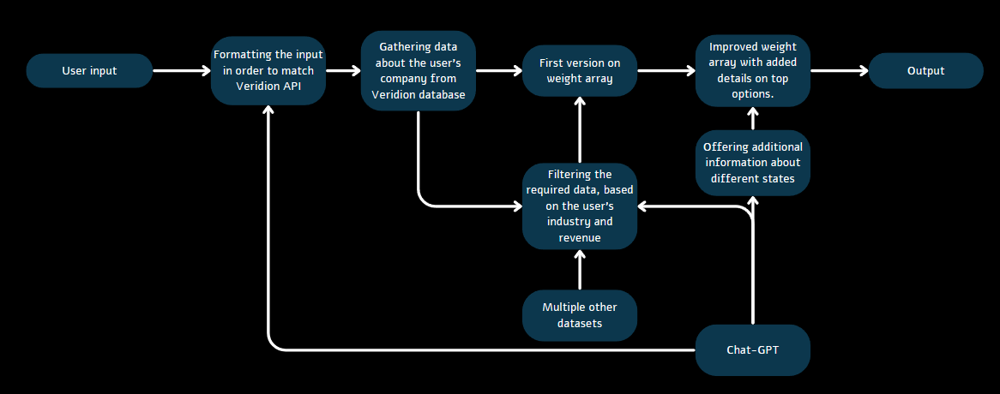

# Expansion Advisor

## Description

The Expansion Advisor is a tool to help, relatively big, companies to find new areas to expand to in United States. Using the Expansion Advisor, companies can find new states and cities to expand to based on their current locations and the locations of their competitors. It uses the [Veridion Data](https://veridion.com/) API, Chat-GPT API and multiple others datasets to find the best locations for the company to expand to.

## Table of Contents

- [Description](#description)
- [Table of Contents](#table-of-contents)
- [Installation and Usage](#installation-and-usage)
- [Implementation](#implementation)
- [Story](#story)

## Installation and Usage

To install the Expansion Advisor, you need to clone this repository and install the dependencies using `pip install -r requirements.txt`. Then, you can run the `expansion_advisor.py` file to start the program. The program will prompt you with a series of questions. Once you answer all the questions, the program will return the best locations for the company to expand to.

> [Note: If the program doesn't work, you might need to change the API keys and urls present in the `constants.py` file.]

## Implementation

TODO: Add description for the diagram
* In the first three steps, the programs filters the 

* 

* The final weighted score is calculated using the following formula

> [Note: Momentarily, the Expansion Advisor only working regions in the United States.]

## Story

The Expansion Advisor was created as a part of the [HackITall](https://hack.lsacbucuresti.ro/) hackathon in Bucharest, Romania. The project was created in 24 hours.

The team is formed of 3 members: [Alexandru](https://github.com/alexandrutrifu), [Rares](https://github.com/rrsmart8) and [me](https://github.com/robertpaulp).